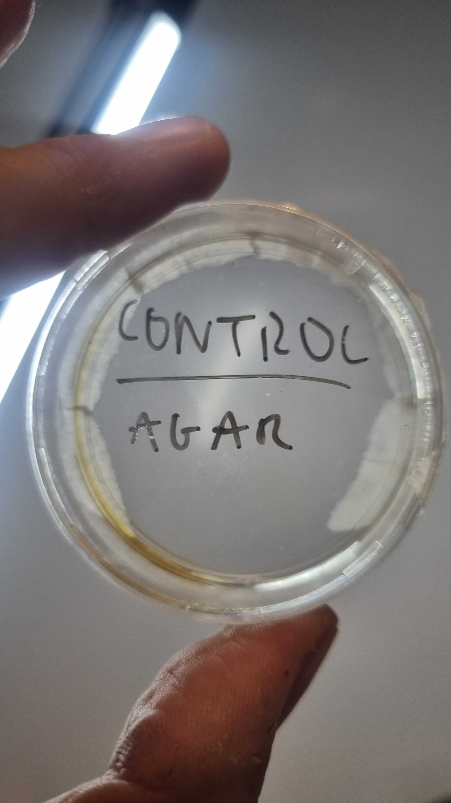
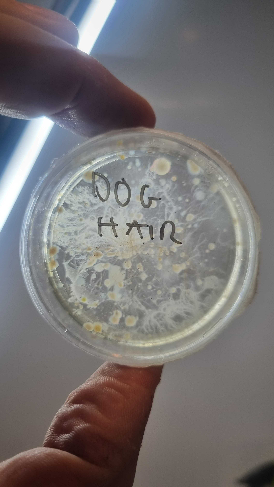
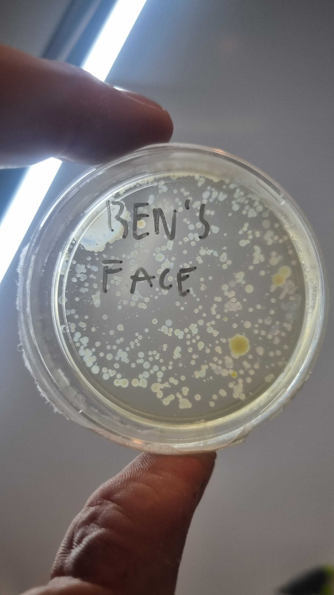

# Plating and finding Bacteria  

A _week 1_ excercise is plating acteria into sterile [AGAR](../protocols%20and%20recipes/platingBacteria) plates.  
3 plates left for 5 days in the incubator:
- control remained clear (so good sterilisation!)  

- the dog hair and face swab plate both show signs of bacteria growth

