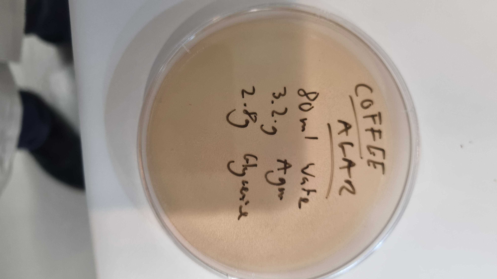

# Week 1 BioPlastics

_"Do we make new things in order to continue business as usual or to find other ways of doing things..."_
###### paraphrased from Maarten Smith's lecture - Introduction to Bioplastics

 
_"A bioplastic is a biobased polymer derived from a biomass, and it may or may not be biodegradable"_  
 
###### from [bioplastics cookbook](https://issuu.com/nat_arc/docs/bioplastic_cook_book_3/s/159731)
 
 
BIO- _'plastics'_ made from organic materials  
 
Begining with Agar as a plant based polymer 
 
Based on the cookbook the suggested recipes are:

|Agar | Glycerine | Water| Brittleness|
|0.6 g| 0.0  |40 ml |1|
|0.6 | 1.4g |40 ml |0.75|
|0.6 g | 2.7g | 40ml | 0.5|
|0.6 g | 5.4g | 40ml |0.25|

First recipes tested:

|polymer | glycerine | water | extras |results |
|agar 3.2 g| 2.8 g | 80 ml | dandelion extract for colour | disk of jelly like substance|
| agar 32.g | 2.8 g | 80 ml | coffee extraction | |

 

#### Observations:  
_Working with small quantities of water makes it hard to control the evaporation and substance - this was supposed to be one up from brittle_ but was a loose jelly like 

- second attempt to create a more _brittle_ substance :

|Agar|Glycerine|Water| extras|
|8g | 0g | 200ml| chili powder|

- Will the chili which is a powder and was 'eyeballed' in affect it 
- the substance was thick and viscous when poured still hot into a plate and a metal mould of an elephant

