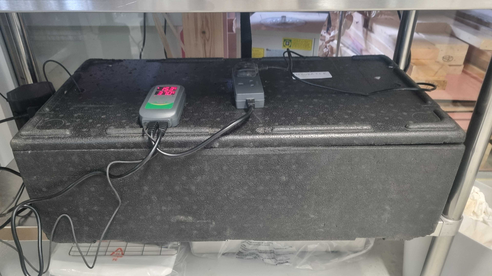

--- 
title: incubator
layout: default
parent: equipment
---

# Incubator  
### a container to encourage growth of material on media with controlled temperature

Using an [INKBIRD](https://inkbird.com/products/temperature-controller-itc-308-wifi) thermostat  

To be improved:
	- struggle to get above high 20s
	- mat fell off top of container
	- repait second mat and place in with grill of some kind on base