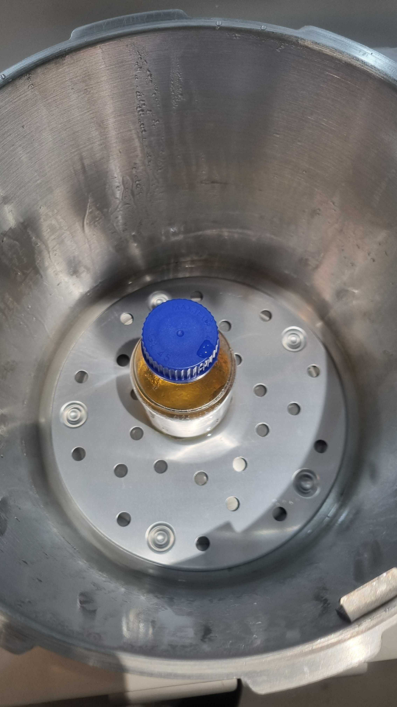

# AUTOCLAVE

The B-A-L uses a presure  cooker as an autoclave.  

This is a process required to sterilise equipment and as part of protocols. It is the surest way to kill bacteria and other unwanted biological agents.
 

 
- place pressure cooker onto the hob (the standalone hob is better suited for the pot size)
- ensure that the plate is in the bottom to raise the equipment off the floor of the pot
- full with 1L of water
- place equipment inside
- close pressure cooker and turn up heat high
- the water will start to boil and steam will begin to esacpe from the valve
- after 10 minutes or so of steam escaping the inside of the pot has turned to a hot steam environment
- drop the pressure regulator onto the valve this allows the temperature in the pot to rise from 100C to 120C (ish)
- watch the pressure and adjust heat to keep it around 15psi
- after 20/30 minutes under pressure turn off heat and allow to cool

_Substance in beaker will now be sterlised meaning it can be used for plating as the only bateria that should be present is that which is introduced after this process._