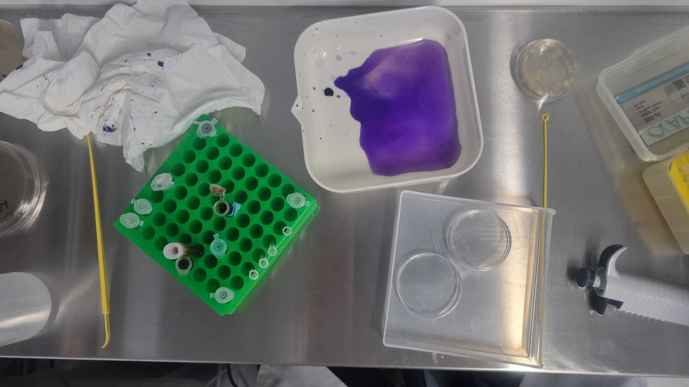
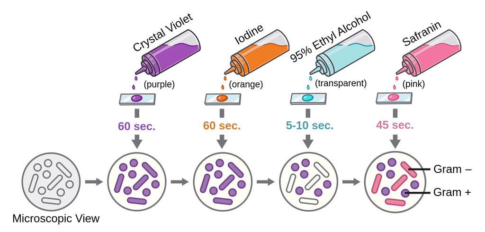

--- 
title: gram-staining
layout: default 
parent: resources
---

# Gram-Staining  
## make your bacteria purple
  

#### A beautiful technique for seeing, indentifying and working with bacteria from samples.
 
Named after Hans Christian Gram who invented the procedure in 1884.  
The procedure classifies bacteria into two large groups: _gram-positive_ or _gram-negative_ based on the physical properties of their cell walls, stainign them either __purple__ ([positive](https://en.wikipedia.org/wiki/Gram-positive_bacteria)) or __pink__ ([negative](https://en.wikipedia.org/wiki/Gram-negative_bacteria)).  _Gram-positive_ bacteria respond better to wall-targeting antibiotis due to their lack of outer membrane (which is also why they take the stain so well).  

Once you can see bacteria you can infer:
- Abundance _(how much)_
- Evenness _(how is it distributed)_
- Moprhology _(what does it look like)_
- Taxonomy (sometimes) _(who is it?)_

You can also use it to differntiate between _bacteria_ and _fungi_ .

#### Needed equipment:

- sample
- microscope plate
- innoculation loop
- bunsen burner
- pipette
- chemicals:
	- _Crystal Violet_ 
	- _Iodine_
	- _Alcohol_ 
	- _Safronin_ 
	- _Water_

#### Steps:

1. Assemble all gear and get a plate
2. Sterilise loop
3. Swab sample
4. Transfer sample to plate (if using water run loop through 20UL of water on plate)
5. Fix to plate by passing it over the burner three times  
6. Apply chemical and __rinse with water__ between each one (see picture) :

|Crystal Violet | Iodine | Alcohol | Safronin |
|1 min | 1 min | 10 secs | 1 min |

_Allow to dry then observe under microscope._