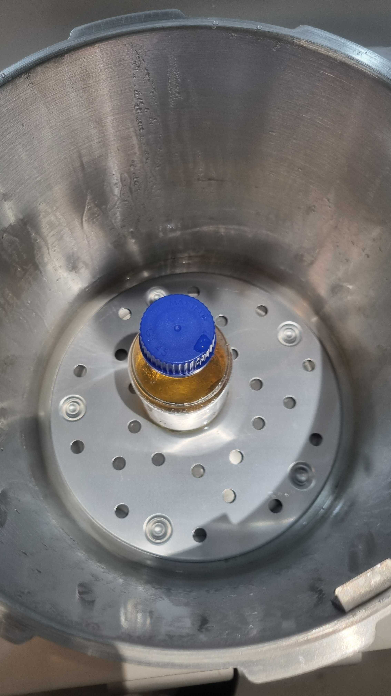

--- 
title: plating bacteria
layout: default
parent: recipes
---
# Plating Bacteria  

In order to plate bacteria it is important that the media receiving it is sterile so that the introduced bacteria is the only one present.  
To plate agar ready to have bacteria introduced follow the [autoclave](autoclave) procedure with the following agar mixtue in the beaker:

| nutrient agar | water |
|37 g| 1L| 

Follow steps to use the autoclave with the beaker in the pressure cooker:

- place beaker in pot, tighten top then crack it slightly again to allow air to escape 
- after 20/30 minutes under pressure turn off heat and allow to cool

_Substance in beaker will now be sterlised meaning it can be used for plating as the only bateria that should be present is that which is introduced after this process._