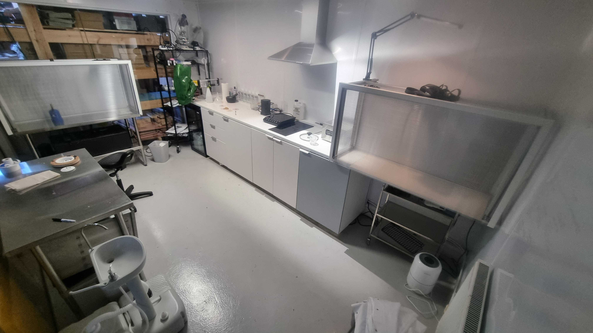

# Invisible Flock Bio Art Lab

### The Bio-Art-Lab (B-A-L) is an emergent lab and creative space in the [Invisible Flock](https://invisibleflock.com) Studio
 

The B-A-L exists to explore practices and techniques related to working with biological and living material, to explore and develop a practice of greater sustainability and entaglement with the natural world.

 
 

This site is a repository of documentation resources and tools relating to the practices taking place with the B-A-L.